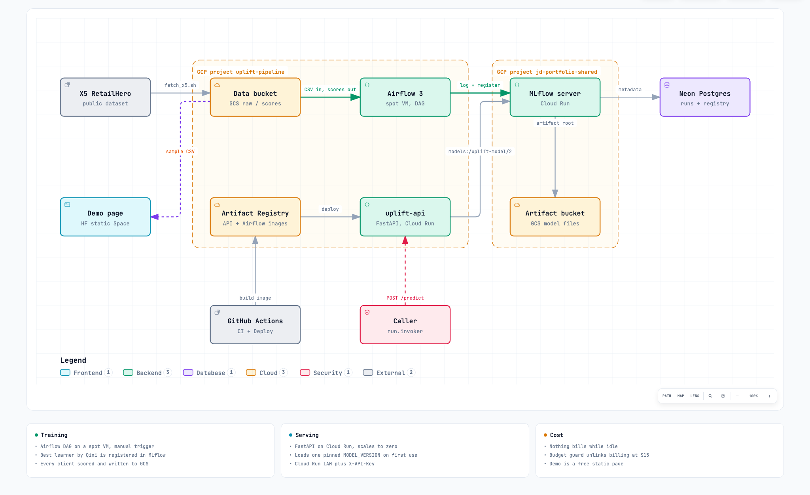
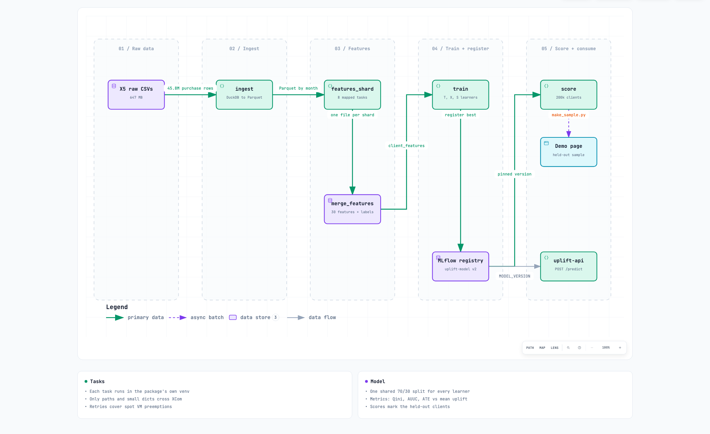
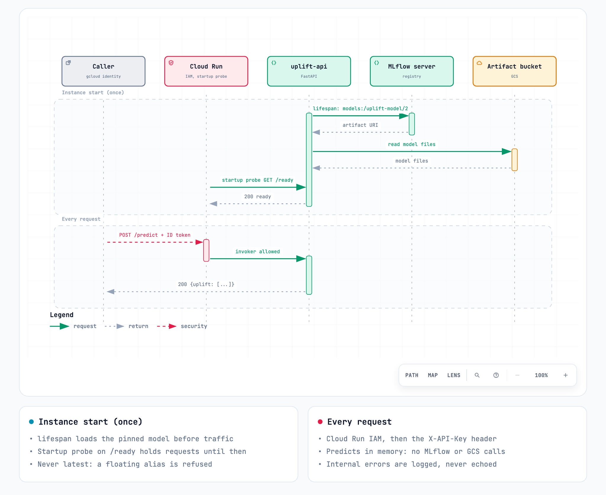

# uplift-pipeline

A marketing campaign converts some customers who would never have bought
without it, and wastes money on others who would have bought anyway. An
uplift model estimates, for each customer, how much the campaign changes
their chance to buy, so the budget goes to the people it actually moves.

This repository builds that model end to end on a real dataset, as a
portfolio project to practice the full MLOps loop on a small budget:
data ingestion, parallel feature building, causal ML, experiment tracking,
a model registry, batch scoring, an online API, CI/CD and infrastructure as
code on GCP.

- **Data:** X5 RetailHero, about 200k clients from a randomized campaign and
  45.8M purchase rows.
- **Model:** T, X and S meta-learners on XGBoost (causalml), compared by Qini.
- **Stack:** DuckDB, Airflow 3, MLflow, FastAPI, Cloud Run, GCS, Terraform,
  GitHub Actions.
- **Demo:** [uplift targeting demo](https://huggingface.co/spaces/sepulvedajd/uplift-targeting-demo)
  (static page on held-out clients).

## Results

On the same 30% test split of X5:

| Learner | Qini | AUUC |
|---|---|---|
| T-learner (XGBoost) | 0.111 | 0.612 |
| X-learner (XGBoost) | 0.142 | 0.643 |
| S-learner (XGBoost) | **0.169** | **0.671** |

The S-learner is registered as `uplift-model` version 2 and served. On a
20k-client held-out sample, targeting the top 20% by predicted uplift brings
about 272 extra conversions, against 133 when the same number of clients is
picked at random.

## Architecture



Two GCP projects. `uplift-pipeline` holds this product: the data bucket, the
Airflow VM, the images and the API. `jd-portfolio-shared` holds what several
portfolio projects share: the MLflow server and its artifact bucket, with
metadata in a free Neon Postgres database.

| Component | What it does | Runs on |
|---|---|---|
| Data bucket | Raw X5 CSVs in, batch scores out | GCS |
| Airflow 3 | Runs the training DAG | Docker Compose on a spot VM that stops itself after 30 idle minutes |
| MLflow server | Tracks runs, holds the model registry | Cloud Run, IAM only, scales to zero |
| Artifact bucket | Model files (`python_model.pkl`, `MLmodel`, requirements) | GCS |
| uplift-api | FastAPI, `POST /predict` for one to 1000 clients | Cloud Run, scales to zero |
| Artifact Registry | API and Airflow images | GCP |
| GitHub Actions | CI on every PR, deploys `dev` to staging and `main` to production | GitHub |
| Demo page | Top-k targeting simulator on precomputed scores | Hugging Face static Space |

Nothing bills while idle, and a budget guard unlinks billing from the project
if spend reaches $15 in a month.

## Training pipeline



The Airflow DAG `uplift_training` is triggered by hand (the dataset is
static):

1. `ingest`: DuckDB converts the raw CSVs to Parquet (45.8M purchase rows),
   purchases partitioned by client shard `hash(client_id) % N`, then month.
2. `features_shard`: builds 30 per-client features in N = 8 shards that run in
   parallel, each reading only its own purchases.
3. `merge_features`: joins the shards with the treatment flag and the label.
4. `train`: fits every learner in `LEARNERS` on one shared split, logs one
   MLflow run per learner with its Qini curve, and registers the best one.
5. `score`: scores every client with the version just registered and writes
   `scores.parquet` (with a `split` column marking held-out clients) to GCS.

A full run takes about 5 minutes on an e2-standard-4 spot VM.

## Serving



The API serves one fixed model version (`MODEL_VERSION`), never `latest`.
Loading a model runs pickled code, so a moving alias would let anyone with
registry write access change what runs in production. Each instance loads the
model once, at startup, and keeps it in memory: a request never calls MLflow
or GCS. `/ready` answers 200 once the model is loaded, and the Cloud Run
startup probe holds traffic until then. `/health` is a plain liveness check.
If the model cannot be loaded, `/ready` and `/predict` answer 503.

`/metrics` exposes Prometheus metrics per instance: request latency by path
and status (p50/p95/p99 come from the histogram), records per request, the
distribution of predicted uplift, rejected requests by reason, and the model
URI being served.

Two checks guard `/predict`: Cloud Run IAM (the caller needs
`roles/run.invoker`) and the `X-API-Key` header.

### Try the API

`gcloud run services proxy` opens a local port that forwards requests with
your gcloud identity, so the interactive docs work in the browser:

```bash
gcloud run services proxy uplift-api-staging --region us-central1 --port 8080
```

The first time, gcloud installs the `cloud-run-proxy` component; run the
command again if it exits after installing. After a scale to zero, the first
request waits about a minute while a new instance loads the model.

Open http://localhost:8080/docs, click "Authorize" and paste the staging key
(`gcloud secrets versions access latest --secret uplift-api-key-staging`).
Each record needs exactly the 30 features the model was trained on; missing
or unknown keys get a 422 that names them. To build a
request from the local feature table:

```bash
uv run python -c "
import json
from uplift_pipeline.data import load_x5_features
df, features = load_x5_features('data/features/x5/client_features.parquet')
print(json.dumps({'records': json.loads(df[features].head(3).to_json(orient='records'))}))
" > request.json

curl -s localhost:8080/predict -H "X-API-Key: $KEY" \
  -H "Content-Type: application/json" -d @request.json
# {"uplift":[0.0178,0.0078,0.0414]}
```

## Model tracking and retraining

Every training run creates one parent MLflow run in the `uplift` experiment
(dataset, learners, Qini and AUUC of each, overlaid Qini curves) and one
child run per learner (metrics, fit time, its curve and the model). Only the
best learner is registered. To browse it:

```bash
gcloud run services proxy mlflow --region us-central1 --project jd-portfolio-shared
```

X5 does not change, so retraining it gives the same model. With live data,
retrain when a new campaign with a random control group closes, when the
Qini measured on that control group drops, or when feature drift (PSI above
0.2) shows the clients have changed. Release a new model by setting
`MODEL_VERSION` in the staging environment first, then in production.

## Drift scenarios

`python -m uplift_pipeline.simulate` resamples held-out X5 clients and breaks
one thing on purpose, to check that monitoring notices. Sent to staging, 10k
clients each:

| Scenario | What changes | Mean uplift | Lift in top 20% |
|---|---|---|---|
| baseline | nothing | 0.028 | +0.120 |
| covariate | spend x1.5, age +10 | 0.030 | +0.120 |
| missing | 30% of rows lose 5 features | 0.012 | +0.111 |
| concept | treatment no longer changes y | 0.028 | -0.019 |

Covariate drift barely moves the predictions, so it has to be caught on the
inputs (PSI). Concept drift leaves inputs and predictions untouched; only
labels from a new campaign with a control group show it.

```bash
uv run python -m uplift_pipeline.simulate covariate --n 10000 \
  --send http://localhost:8080 --api-key "$KEY" --out covariate.parquet
```

### Drift checks

Training logs `reference_profile.json` next to the registered model: decile
edges and shares of every feature (null as its own bin) and of the predicted
uplift. `python -m uplift_pipeline.drift REFERENCE CURRENT` compares a batch
against it and can push the result to a Prometheus Pushgateway. On the
scenarios above:

| Scenario | Features with PSI > 0.2 | Uplift PSI | Lift in top 20% |
|---|---|---|---|
| baseline | none | 0.00 | +0.120 |
| covariate | age, mean_spend, max_spend | 0.02 | +0.120 |
| missing | the 5 nulled features | 0.40 | +0.111 |
| concept | none | 0.00 | -0.019 |

```bash
uv run python -m uplift_pipeline.drift reference_profile.json covariate.parquet \
  --pushgateway localhost:9091 --window covariate
```

## Run locally

Requires [uv](https://docs.astral.sh/uv/). On macOS, xgboost also needs
`brew install libomp`.

```bash
uv sync
uv run pre-commit install
```

Without `FEATURES_PATH` the code trains on synthetic data, which the tests
also use. Train and register a model, then serve the version it prints:

```bash
uv run python -m uplift_pipeline.train
# registered uplift-model version 1 (serve it with MODEL_VERSION=1)
MODEL_VERSION=1 API_KEY=dev-key uv run uvicorn uplift_pipeline.serving.app:app --reload
```

To run the full pipeline on X5 with Airflow on your machine, see
[airflow/README.md](airflow/README.md).

Checks:

```bash
uv run pytest
uv run pre-commit run --all-files
uv run mypy src
```

## Reproduce on GCP

1. Download the data and upload it:

   ```bash
   scripts/fetch_x5.sh gs://PROJECT-uplift-data
   ```

2. Create the infrastructure. `infra/main.tf` creates the APIs, the data
   bucket, the Artifact Registry repository, service accounts, Workload
   Identity Federation for GitHub and the budget guard. `infra/airflow_vm.tf`
   adds the Airflow VM, off by default.

   ```bash
   gcloud auth application-default login
   cd infra
   cp terraform.tfvars.example terraform.tfvars   # set project and billing account
   terraform init
   terraform apply -var airflow_vm_enabled=true
   terraform output github_variables
   ```

3. Configure GitHub: add the values from `terraform output github_variables`
   plus `MLFLOW_TRACKING_URI` as repository variables, then create the
   `staging` (branch `dev`) and `production` (branch `main`, tags `v*`,
   required reviewers) environments, each with a `MODEL_VERSION` variable.

4. Store one API key per environment without echoing it:

   ```bash
   openssl rand -hex 24 | tr -d '\n' | gcloud secrets versions add uplift-api-key-staging --data-file=-
   openssl rand -hex 24 | tr -d '\n' | gcloud secrets versions add uplift-api-key --data-file=-
   ```

5. Build the Airflow image and train:

   ```bash
   gcloud builds submit --config airflow/cloudbuild.yaml .
   scripts/airflow_vm.sh start
   scripts/airflow_vm.sh trigger
   ```

6. Set `MODEL_VERSION` in the `staging` environment to the registered
   version. Every merge into `dev` deploys `uplift-api-staging`; merging `dev`
   into `main` deploys `uplift-api` after a reviewer approves it.

7. Refresh and publish the demo from the new scores
   ([demo/README.md](demo/README.md)).

## Configuration

| Variable | Default | Description |
|---|---|---|
| `MLFLOW_TRACKING_URI` | `sqlite:///mlflow.db` | MLflow server |
| `MLFLOW_EXPERIMENT` | `uplift` | Experiment name |
| `REGISTERED_MODEL` | `uplift-model` | Registry model name |
| `FEATURES_PATH` | none | X5 feature table (Parquet) to train on; unset uses synthetic data |
| `LEARNERS` | `t_xgb,x_xgb,s_xgb` | Learners to compare (`t_xgb`, `x_xgb`, `s_xgb`); the best Qini is registered |
| `MODEL_VERSION` | none | Model version to serve |
| `MODEL_URI` | none | Full model URI, overrides `MODEL_VERSION` |
| `SCORES_PATH` | `data/scores/x5/scores.parquet` | Output of `python -m uplift_pipeline.score` |
| `ALLOW_UNPINNED_MODEL` | `false` | Local only: allow serving `latest` |
| `API_KEY` | none | Required by `/predict` (sent as `X-API-Key`) |
| `MAX_RECORDS` | `1000` | Max rows per request |
| `MAX_BODY_BYTES` | `1048576` | Max request size |

## Project layout

```
src/uplift_pipeline/
  config.py        settings from environment variables
  data/            X5 ingestion and loading, synthetic data
  features/        per-client X5 features in hash shards
  models/          T, X and S learners, saved as an MLflow pyfunc model
  evaluation/      Qini, AUUC and Qini curves
  train.py         train, compare, register the best learner
  score.py         batch scoring: uplift for every client, highest first
  serving/app.py   FastAPI app
dags/              Airflow DAG (ingest, features, train, score)
airflow/           Docker Compose stack and image for Airflow
infra/             Terraform for the GCP resources
scripts/           dataset download, Airflow VM helper
docker/            API image
demo/              static targeting demo (Hugging Face Space)
docs/diagrams/     diagram sources (Archify JSON) and images
tests/             unit and integration tests
```

## Contributing

Changes go on a `feat/`, `fix/` or `chore/` branch cut from `dev` and merge
into `dev` through a pull request, which deploys to staging. Merging `dev`
into `main` releases to production after approval. Details, checks and PR
templates are in [CONTRIBUTING.md](CONTRIBUTING.md).
